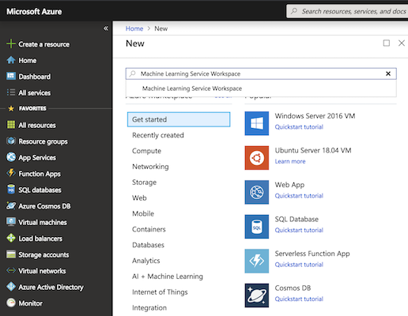
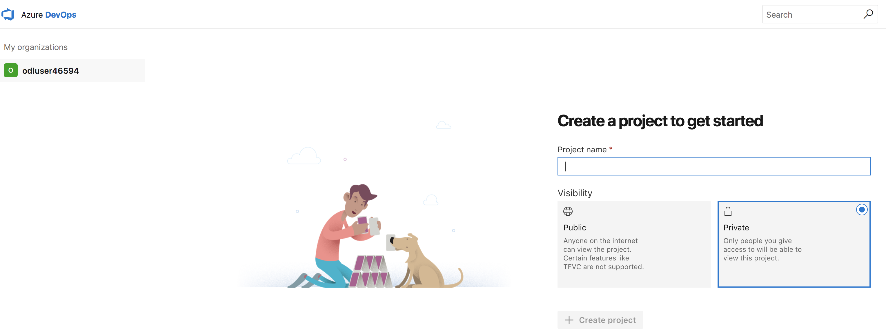
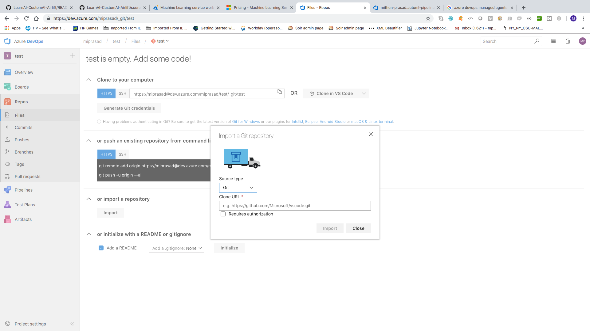
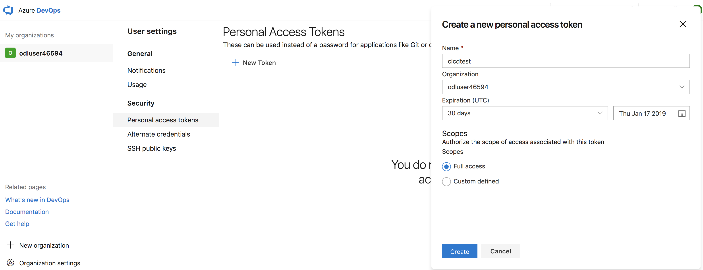
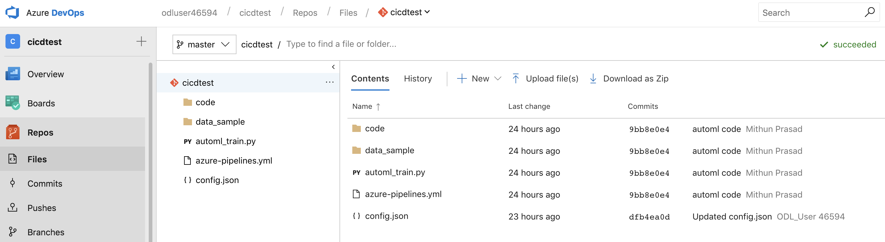

# Setup

This lab allows you to perform setup for building a Continuous Integration/Continuous Deployment pipeline related to Anomoly Detection and Predictive Maintenance. 

### Pre-requisites

- Azure account
- Azure DevOps Account
- Azure Machine Learning Service Workspace
- Basic knowledge of Python

After you launch your environment, follow the below steps:

### Azure Machine Learning Service Workspace

We will begin the lab by creating a new Machine Learning Service Workspace using Azure portal:

1. Login to Azure portal using the credentials provided with the environment.

2. Select `Create a Resource` and search the marketplace for `Machine Learning Service Workspace`.



3. Select `Machine Learning Service Workspace` followed by `Create`:


4. Populate the mandatory fields (Workspace name, Subscription, Resource group and Location):


### Sign in to Azure DevOps

Go to https://dev.azure.com and login using the username and password provided. After logging in, you should see the below:



### Create a Project

Create a Private project by providing a `Project name`. With private projects, only people you give access to will be able to view this project. Select `Create` to create the project.

### Repository

After you create your project in Azure DevOps, you can begin coding with Git. To work with a Git repo, there are a couple of different ways you can bring content into your repo:

1. The simplest way is to import using the `import` wizard found in Repos -> Files -> Import as shown below. Provide the clone url (https://github.com/azure/learnai-customai-airlift) in the wizard to import.



2. The alternative way is to use a git client to clone the learnai repo to your computer. Cloning a repo creates a complete local copy of the repo for you to work with. Cloning also downloads all commits and branches in the repo, and sets up a named relationship with the repo on the server.

- Open the project for your organization, and select Repos.
- In this lab, we will use `Personal access tokens` which is very easy to setup and very secure. Select `Generate Git Credentials` and then `Create a Personal access token`.

- Create a new personal access token by providing a name. Authorize scope of access to `Full access` as shown below:


    

- Select `Create` to generate the token and copy the token to a safe location. For example, a successfully generated token would look as follows:

    

- Setup your repo by following the below steps:
````
    git clone https://<your username>.visualstudio.com/<your project>/_git/<your repository>
    git clone https://github.com/azure/learnai-customai-airlift
````

Copy the content from our repo into your cloned repository. For example:
````
    cp -r learnai-customai-airlift/* <your repository>
````

Then change directory into your repository, include all the files you just added to be tracked by git, and commit and push your repository to the remote location on ```dev.azure.com```.

````
    cd <your repository>
    git add .
    git commit -m "commit msg"
    git push origin master
````

After running the above steps, your repo should now be populated and would look like below:



