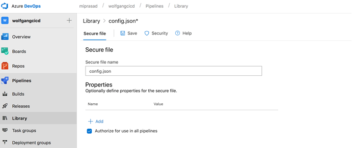
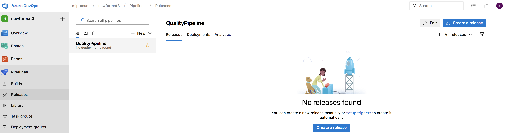
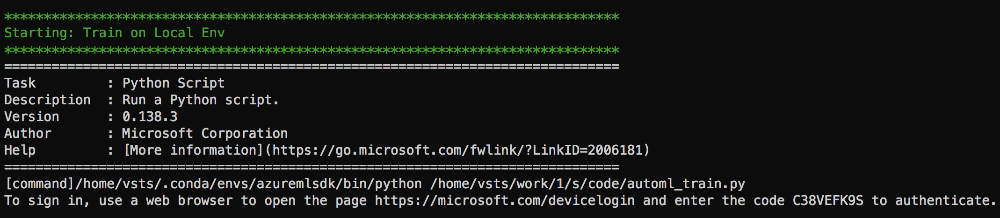
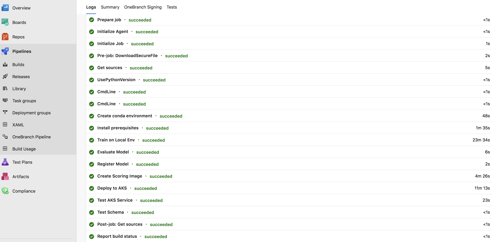
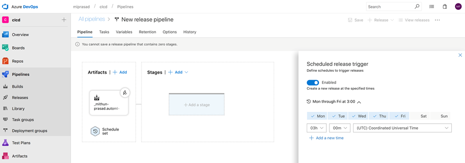

# Building the pipeline

Tha aim of this lab is to demonstrate how you can build a Continuous Integration/Continuous Deployment pipeline and kick it off when there is a new commit. This scenario is typically very common when a developer has updated the application part of the code repository or when the training script from a data scientist is updated.

### A. Hosted Agents

With Azure Pipelines, you've got a convenient option to build and deploy using a **Microsoft-hosted agent**. Each time you run a pipeline, you get a fresh virtual machine and maintenance/upgrades are taken care for you. The virtual machine is discarded after one use. The Microsoft-hosted agent pool provides 5 virtual machine images to choose from:

- Ubuntu 16.04
- Visual Studio 2017 on Windows Server 2016
- macOS 10.13
- Windows Server 1803 (win1803) - for running Windows containers
- Visual Studio 2015 on Windows Server 2012R2

YAML-based pipelines will default to the Microsoft-hosted agent pool. You simply need to specify which virtual machine image you want to use.

### B. Code Repository

The repo is organized as follows:

```
    code
    code/testing/
    code/scoring/
    code/aml_config/
    data_sample
    azure-pipelines.yml
```

The `code` folder contains all the python scripts to build the pipeline. The testing and scoring scripts are located in `code/testing/` and `code/scoring/` respectively. The config files created by the scripts are stored in `code/aml_config/`.

Sample data is created in `data_sample` that is used for testing. `azure-pipelines.yml` file at the root of your repository contains the instructions for the pipeline.

### C. Config

Create a file called `config.json` to capture the `subscription_id`, `resource_group`, `workspace_name` and `workspace_region`:

```
{
    "subscription_id": ".......",
    "resource_group": ".......",
    "workspace_name": ".......",
    "workspace_region": "......."
}
```

You can get all of the info from the Machine Learning service workspace created in the portal as shown below:


### D. Secure Files

It's not best practice to commit the above config information to your source repository. To address this, we can use the Secure Files library to store files such as signing certificates, Apple Provisioning Profiles, Android Keystore files, and SSH keys on the server without having to commit them to your source repository. Secure files are defined and managed in the Library tab in Azure Pipelines.

The contents of the secure files are encrypted and can only be used during the build or release pipeline by referencing them from a task. There's a size limit of 10 MB for each secure file.

#### Upload Secure File

1. Select Pipelines, Library and Secure Files as shown below:

    !Upload Secure File](../../images/uploadSecureFile.png)

2. Select `+Secure File` to upload config.json file.

3. Select the uploaded file `config.json` and ensure `Authorize for use in all pipelines` is ticked. Select `Save`:

    

### E. Build

Azure Pipelines allow you to build AI applications without needing to set up any infrastructure of your own. Python is preinstalled on Microsoft-hosted agents in Azure Pipelines. You can use Linux, macOS, or Windows agents to run your builds.

#### New Pipeline

1. To create a new pipeline, select `New pipeline` from the Pipelines blade:

    

2. You will be prompted with "Where is your code?". Select `Azure Repos` followed by your repo.

3. Select `Run`. Once the agent is allocated, you'll start seeing the live logs of the build.

#### Interactive Authentication

At the train step, you will recieve a message for interactive authentication as shown below. Open a web browser to open the page https://microsoft.com/devicelogin and enter the code to authenticate for the build to resume.



Eventually on success, the build status would appear as follows:



#### Notification

The summary and status of the build will be sent to the email registered (i.e. Azure login user). Login using the email registered at `www.office.com` to view the notification.

### F. Azure Pipelines with YAML

You can define your pipeline using a YAML file: `azure-pipelines.yml` alongside the rest of the code for your app. The big advantage of using YAML is that the pipeline is versioned with the code and follows the same branching structure. 

The basic steps include:

1. Configure Azure Pipelines to use your Git repo.
2. Edit your `azure-pipelines.yml` file to define your build.
3. Push your code to your version control repository which kicks off the default trigger to build and deploy.
4. Code is now updated, built, tested, and packaged. It can be deployed to any target.


Open the yml file in the repo to understand the build steps.

### G. Test

In this workshop, multiple tests are included:

1. A basic test script `code/testing/data_test.py` is provided to test the schema of the json data for prediction using sample data in `data_sample/predmain_bad_schema.csv`.

2. `code/aci_service_test.py` and `code/aks_service_test.py` to test deployment using ACI and AKS respectively.

#### Exercise

- Can you either extend `code/testing/data_test.py` or create a new one to check for the feature types? 

- `code/aci_service_test.py` and `code/aks_service_test.py` scripts check if you are getting scores from the deployed service. Can you check if you are getting the desired scores by modifying the scripts?

- Make sure `azure-pipelines.yml` captures the above changes

### H. Release

In this section, you will learn how to schedule release at specific times by defining one or more scheduled release triggers. 

#### Create Release Pipeline

#### Time Trigger

1. Choose the schedule icon in the Artifacts section of your pipeline and enable scheduled release triggers. Note: you can configure multiple schedules.

    

2. Select a time to schedule release trigger. For viewing the trigger execution, you can choose a trigger time that's about 10 mins from now.

#### Build Trigger (Continuous deployment trigger)

Along with the time triggers, we cann can also create a release every time a new build is available.

1. Enable the *Continuous deployment trigger* and ensure *Enabled* is selected in the *Continuous deployment trigger* configuration as shown below:


2. Populate the branch in *Build branch filters*. A release will be triggered only for a build that is from one of the branches populated. For example, selecting "master" will trigger a release for every build from the master branch.

#### Approvals

For the QC task, you will recieve an *Azure DevOps Notifaction* email to view approval. On selecting *View Approval*, you will be taken to the following page to approve/reject:


There is also provision to include comments with approval/reject:


Once the post-deployment approvals are approved by the users chosen, the pipeline will be listed with a green tick next to QC under the list of release pipelines: 


#### I. Application Insights (Optional)

For your convenience, Azure Application Insights is automatically added when you create the Azure Machine Learning workspace. In this section, we will look at how we can investigate the predictions from the service created using `Analytics`. Analytics is the powerful search and query tool of Application Insights. Analytics is a web tool so no setup is required.

Run the below script (after replacing `<scoring_url>` and `<key>`) locally to obtain the predictions. You can also change `input_j` to obtain different predictions.

```python
import requests
import json

input_j = [[1.92168882e+02, 5.82427351e+02, 2.09748253e+02, 4.32529303e+01, 1.52377597e+01, 5.37307613e+01, 1.15729573e+01, 4.27624778e+00, 1.68042813e+02, 4.61654301e+02, 1.03138200e+02, 4.08555785e+01, 1.80809993e+01, 4.85402042e+01, 1.09373285e+01, 4.18269355e+00, 0.00000000e+00, 0.00000000e+00, 0.00000000e+00, 0.00000000e+00, 3.07200000e+03, 5.64000000e+02, 2.22900000e+03, 9.84000000e+02, 0.00000000e+00, 0.00000000e+00, 0.00000000e+00, 0.00000000e+00, 3.03000000e+02, 6.63000000e+02, 3.18300000e+03, 3.03000000e+02, 5.34300000e+03, 4.26300000e+03, 6.88200000e+03, 1.02300000e+03, 1.80000000e+01]]

data = json.dumps({'data': input_j})
test_sample = bytes(data, encoding = 'utf8')

url = '<scoring_url>'
api_key = '<key>' 
headers = {'Content-Type':'application/json', 'Authorization':('Bearer '+ api_key)}

resp = requests.post(url, test_sample, headers=headers)
print(resp.text)

```

1. From the Machine Learning Workspace in the portal, Select `Application Insights` in the overview tab:


2. Select Analytics.

3. The predictions will be logged which can be queried in the Log Analytics page in the Azure portal as shown below. For example, to query `requests`, run the following query:

````
    requests
    | where timestamp > ago(3h)
````


#### J. Service Principal Authentication (Optional)

ServicePrincipalAuthentication class allows for authentication using a service principle instead of users own identity. The class is ideal for automation and CI/CD scenarios where interactive authentication is not desired. The below snippet shows how you can create a workspace using ServicePrincipalAuthentication.

````python
    from azureml.core.authentication import ServicePrincipalAuthentication
    spa = ServicePrincipalAuthentication(<tenant_id>, <username>, <password>) 
    # Example: spa = ServicePrincipalAuthentication('0e4cb6d6-25c5-4c27-a1ca-42a112c18b71', '59d48937-6e62-4223-b07a-711b11ad24b6', 'zcnv77SNT*Vu')
    ws = Workspace.from_config(auth=spa)
````

#### Exercise

1. Replace `tenant_id`, `username` and `password` with the values generated during the lab creation by reading these values from a secure file. Modify `ws = Workspace.from_config()` in the scripts to use `ServicePrincipalAuthentication`. Perform build again to avoid interactive authentication.

#### K. Data Changes

A data scientist may want to trigger the pipeline when new data is available. To illustrate this, a small incremental data is made available in `data_sample\telemetry_incremental.csv` which is picked up in the below code snippet of anom_detect.py:

````python
    print("Adding incremental data...")
    telemetry_incremental = pd.read_csv(os.path.join('data_sample/', 'telemetry_incremental.csv'))
    telemetry = telemetry.append(telemetry_incremental, ignore_index=True)
````

The data changes would cause a change in the model evaluation and if it's better than the baseline model, it would be propagated for deployment.